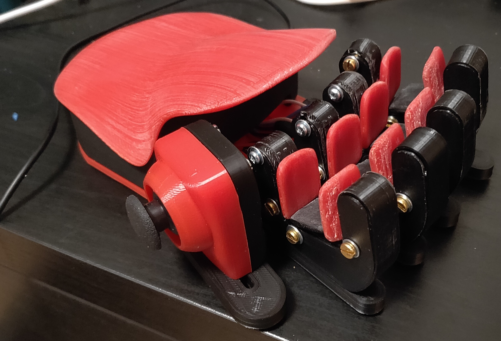

# Azeron-Clone-FullJoystick Controller

Original 3d model for printing
Copyright by Nagooyen on [cults3d.com](https://cults3d.com/en/3d-model/gadget/ergonomic-gaming-keypad-nagooyen)

Build instructions by Lordofthedum on [www.instructables.com](https://www.instructables.com/Azeron-Game-Pad-DIY-Under-35/)

---

This is an alternate version for coding Arduino as a full usb Joystick, instead of a keyboard emulator as shown by original instruction by lordofthedum.

The original code featured a 4-way joystick (configured as a d-pad) to replicate WASD keys, but didn't work for diagonal movement (W+A or W+D or S+D or S+A). I've forked the original code and made a variant for diagonals. You can check it out on [github](https://github.com/mano82/Azeron-Clone-Controller).

However I've found some errors or imprecision of the movements that, not being a programmer, I can't solve yet.

The solution I've found is to program Arduino as a full Joystick peripheral using the [joystick.h library](https://github.com/MHeironimus/ArduinoJoystickLibrary/tree/version-2.0) and running the software [JoyToKey](https://www.emutopia.com/index.php/emulators/item/240-gamepads/470-joytokey).

With JoyToKey you're able to configure every button and axis assigning them to a keypress, macro, or any possible combination. When joystick axis are configured to WASD keys I've found no issue and properly analog movement ingame.

---

This is not a build instruction, please refer to lordofthedum project on instructables.com

You can use my solution as an alternative to the original code by AnonEngineering proposed in that instructable.

I've found a different pinout on my arduino pro micro with respect to the instructables one.
Check it below (difference was in order of analog pins A1, A2, A3)


Wiring and push-button pins are considered according to Lordofthedum build scheme.


Check your pins and test assignments. Probably it is needed to tweak joystick directions (just change the reference to up, down, left and right variables).

Push-buttons pins definition is really easy and defined in the following line:

```C
CButton Buttons[PINS] ={3,2,4,5,6,7,8,9,10,15,14,16,21};
```

You can configure a joystick up to 32 buttons, just add the pin reference to the Buttons array and the `#define PINS` number.

Enjoy!




